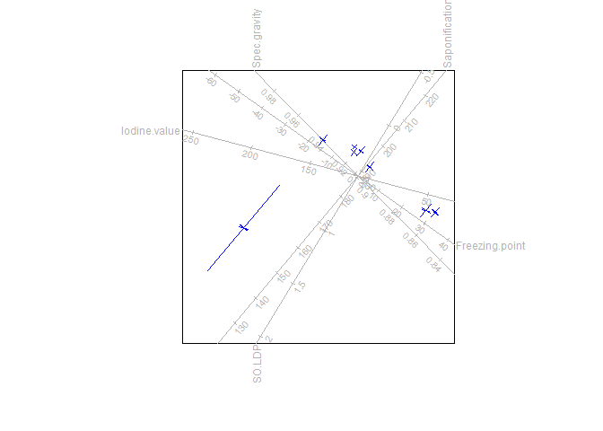
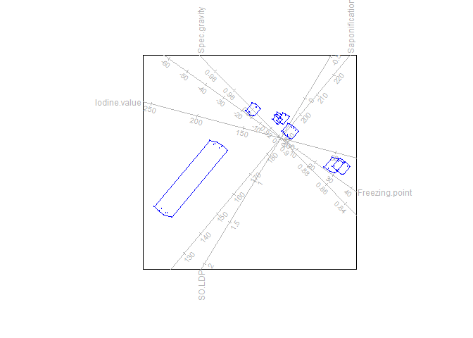
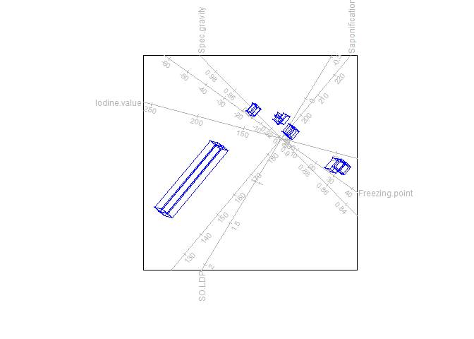

<!-- README.md is generated from README.Rmd. Please edit that file -->

# DDbiplotEZ

<!-- badges: start -->
<!-- badges: end -->

The goal of DDbiplotEZ is to expand on the R package `biplotEZ` by
adding functionality for distributional data objects.

## Installation

You can install the development version of DDbiplotEZ from
[GitHub](https://github.com/) with:

``` r
devtools::install_github("sugnet/DDbiplotEZ")
```

## Example

Construct a PCA biplot for the Oils.data.

``` r
library(DDbiplotEZ)
ddbiplot (Oils.data, scaled = TRUE) |> PCA() |> plot(type = "intervals")
```



``` r
ddbiplot (Oils.data, scaled = TRUE) |> PCA() |> vertices (type = "convexhull") |> 
  plot (type = "vertices")
```



``` r
ddbiplot (Oils.data, scaled = TRUE) |> PCA() |> vertices (type = "connect") |> 
  plot (type = "vertices")
```


